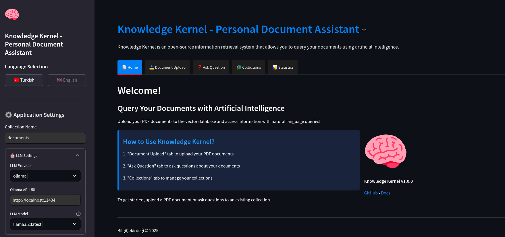

# 🧠 BilgiÇekirdeği (Knowledge Kernel)

BilgiÇekirdeği, dokümanlarınızı yapay zeka ile sorgulamanızı sağlayan açık kaynaklı bir bilgi erişim sistemidir. PDF belgelerinizi vektör veritabanına yükleyin ve doğal dil sorguları ile bilgiye ulaşın!



## 🌟 Özellikler

- 📄 PDF belgelerini vektör veritabanına indeksleme
- ❓ Dokümanları doğal dil ile sorgulama
- 🔄 OpenAI veya Ollama LLM modelleri desteği
- 📊 Kullanıcı dostu web arayüzü
- 📝 Yanıtlarınız için kaynak belgeleri görüntüleme

## 📋 Gereksinimler

- Python 3.8 veya üzeri
- Ollama (yerel AI modelleri için) veya OpenAI API anahtarı
- Langchain ve ilgili bağımlılıklar

## 🚀 Kurulum

1. Depoyu klonlayın:
```bash
git clone https://github.com/kullanici/bilgicekirdegi.git
cd bilgicekirdegi
```

2. Python sanal ortamı oluşturun ve bağımlılıkları yükleyin:
```bash
python -m venv venv
source venv/bin/activate  # Linux/Mac
# veya
venv\Scripts\activate  # Windows

pip install -r requirements.txt
```

3. (İsteğe Bağlı) Ollama kurulumu:
Yerel AI modelleri kullanmak için [Ollama'yı](https://ollama.ai/) indirin ve kurun.
```bash
ollama pull llama3.2:latest
```

4. (İsteğe Bağlı) OpenAI API anahtarı ayarlayın:
```bash
# .env dosyası oluşturun
echo "OPENAI_API_KEY=your_api_key_here" > .env
```

## 🖥️ Kullanım

### Web Arayüzü ile Kullanım

1. Streamlit arayüzünü başlatın:
```bash
streamlit run app.py
```

2. Tarayıcıda http://localhost:8501 adresine gidin.

3. "Doküman Yükleme" sekmesinden PDF belgelerinizi yükleyin.

4. "Soru Sorma" sekmesinden dokümanlarınıza sorular sorun.

### Komut Satırı ile Kullanım

1. PDF belgesini yüklemek için:
```bash
python main.py load_pdf /path/to/your/document.pdf --collection documents
```

2. Dokümanları sorgulamak için:
```bash
python main.py query "Sorgunuz buraya"
```

## 🛠️ Proje Yapısı

```
bilgicekirdegi/
├── app.py                # Streamlit web arayüzü
├── main.py               # Komut satırı arayüzü
├── ingestion/            # Doküman yükleme modülleri
│   └── load_pdf.py       # PDF yükleme ve işleme
├── vectorstore/          # Vektör veritabanı modülleri
│   └── vector_db.py      # FAISS vektör veritabanı
├── embeddings/           # Embedding modülleri
│   └── embedder.py       # Doküman vektörleştirme
├── qa/                   # Soru-cevap modülleri
│   └── rag_chain.py      # RAG (Retrieval Augmented Generation) zinciri
├── utils/                # Yardımcı modüller
│   └── logging_config.py # Loglama yapılandırması
├── indices/              # Vektör indeksleri
└── logs/                 # Log dosyaları
```

## 🤝 Katkıda Bulunma

Katkılarınızı bekliyoruz! Lütfen bir issue açın veya pull request gönderin.

## 📜 Lisans

Bu proje MIT lisansı altında lisanslanmıştır. Detaylar için `LICENSE` dosyasına bakın.

## 👥 İletişim

- GitHub: [@kullanici](https://github.com/kullanici)
- E-posta: ornek@email.com 